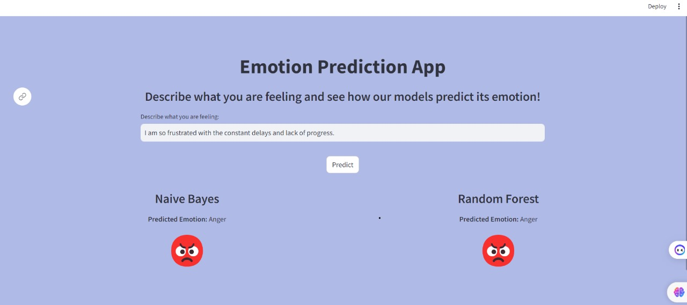
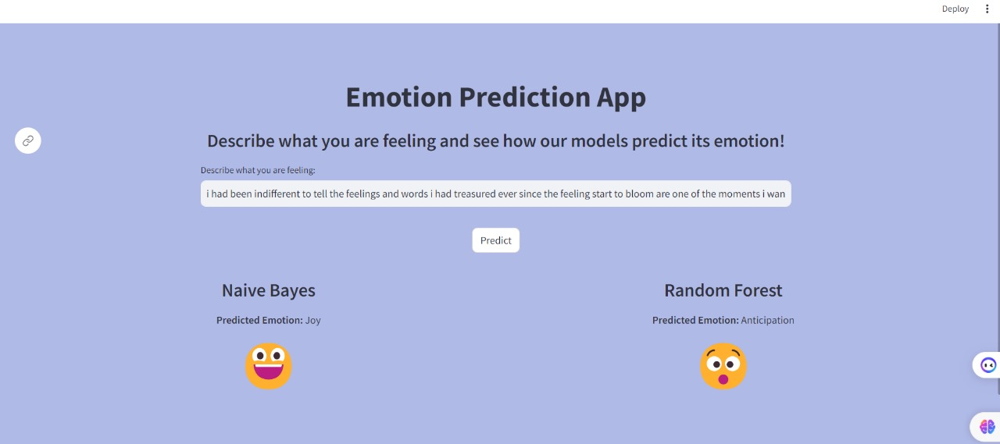
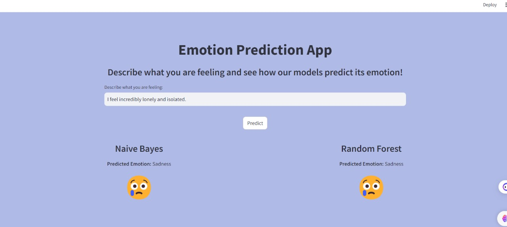
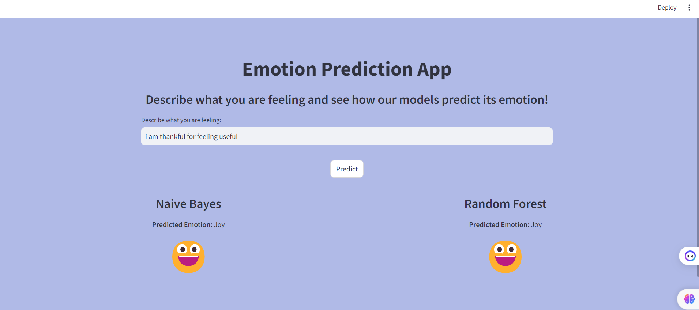
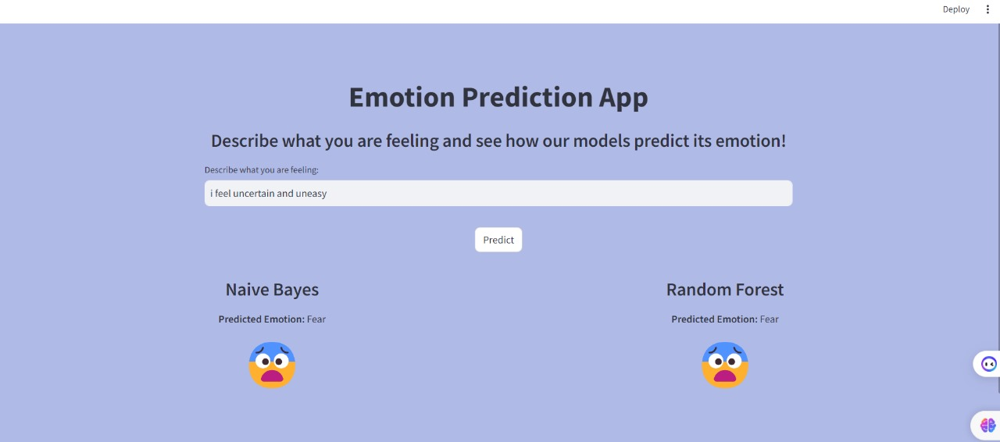
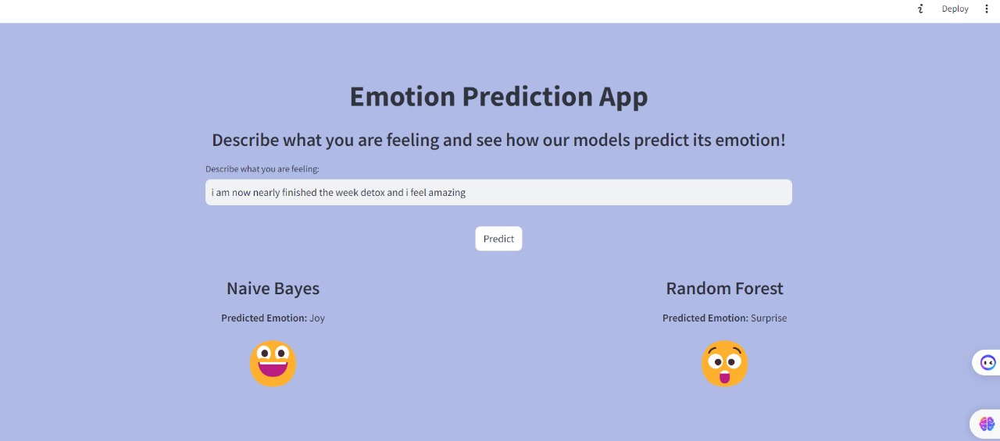

<h1>Emotion-Prediction-App😀</h1>

The Emotion Prediction App is a web application that predicts the emotion associated with a given text input. It utilizes machine learning models trained on a dataset of text samples labeled with six basic emotions: Sadness, Joy, Anticipation, Anger, Fear, and Surprise. The application provides predictions using two different machine learning algorithms: Naive Bayes and Random Forest.

<h2>Code Overview</h2>
<ol>
  <li><strong>Import Necessary Modules:</strong> Install required packages and download the Spacy English language model.</li>
  <li><strong>Exploratory Data Analysis (EDA):</strong> Explore the dataset to understand its structure and distribution.</li>
  <li><strong>Preprocessing:</strong> Preprocess the text data by tokenization, lemmatization, and removing stop words.</li>
  <li><strong>Encoding Target Column:</strong> Map the emotion labels to numerical values.</li>
  <li><strong>Split Data into Train and Test:</strong> Split the dataset into training and testing sets.</li>
  <li><strong>Convert Text Column to Numeric Vector:</strong> Use TF-IDF vectorization to convert the text data into numeric vectors.</li>
  <li><strong>Visualizations of Data:</strong> Generate visualizations to gain insights into the dataset.</li>
  <li><strong>Machine Learning Model:</strong>
    <ul>
      <li><strong>Naive Bayes:</strong>
        <ul>
          <li>Train a Multinomial Naive Bayes model and evaluate its performance.</li>
          <li><strong>Confusion Matrix:</strong>
            
          </li>
        </ul>
      </li>
      <li><strong>Random Forest:</strong>
        <ul>
          <li><strong>Random Forest:</strong>
            <ul>
              <li>Train a Random Forest model and evaluate its performance.</li>
              <li><strong>Confusion Matrix:</strong>
                
              </li>
            </ul>
          </li>
        </ul>
      </li>
    </ul>
  </li>
  <li><strong>Test Model:</strong> Test the trained models with new text inputs to make predictions.</li>
</ol>

<h2>Screenshots</h2>

<h3>Anger Emotion</h3>

<h3>Anticipation Emotion</h3>

<h3>Sad Emotion</h3>

<h3>Joy Emotion</h3>

<h3>Fear Emotion</h3>

<h3>Surprise Emotion</h3>

